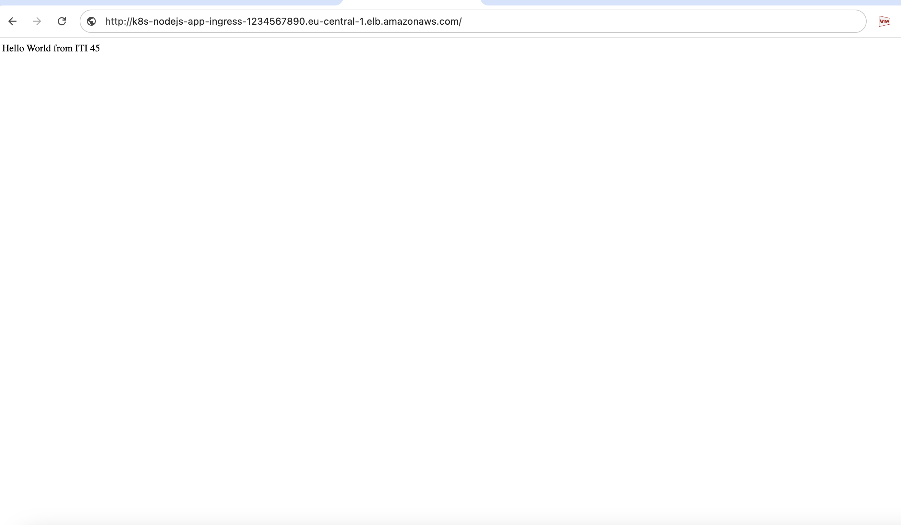
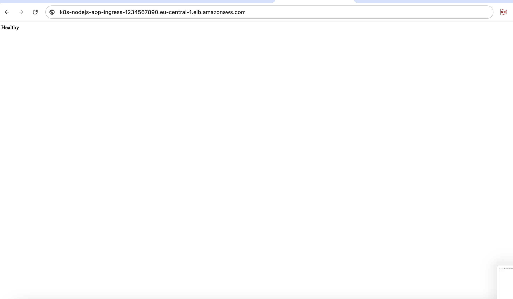

- `k8s/back/back_deployment.yaml`  
- `k8s/back/back_service.yaml`  
- `k8s/back/secret-provider.yaml`  
- `k8s/back/ingress.yaml`  
- `k8s/db/db-pv.yaml`  
- `k8s/db/db-pvc.yaml`  
- `k8s/db/db-service.yaml`  
- `k8s/db/mysql-statefulset.yaml`  
- `k8s/db/network-policy.yaml`  
- `k8s/db/secret-provider.yaml`  
- `k8s/redis/redis-deploy.yaml`  
- `k8s/redis/redis-pvc.yaml`  
- `k8s/redis/redis-service.yaml`  
- `terraform/nginx.conf`

---


This directory contains the **Kubernetes manifests** and **NGINX configuration** for deploying a secure, scalable, and production-ready three-tier application architecture:

- **Backend**: Node.js API (hosted in ECR)
- **Database**: MySQL (StatefulSet)
- **Cache**: Redis (Deployment)

All components are deployed across isolated namespaces (`back-ns`, `db-ns`, `redis-ns`) and follow GitOps, security, and observability best practices.

---

## 🗂️ Directory Structure

```
k8s/
├── back/                   # Backend service (Node.js)
│   ├── back_deployment.yaml
│   ├── back_service.yaml
│   ├── ingress.yaml
│   └── secret-provider.yaml
├── db/                     # MySQL database
│   ├── db-pv.yaml
│   ├── db-pvc.yaml
│   ├── db-service.yaml
│   ├── mysql-statefulset.yaml
│   ├── network-policy.yaml
│   └── secret-provider.yaml
└── redis/                  # Redis cache
    ├── redis-deploy.yaml
    ├── redis-pvc.yaml
    └── redis-service.yaml

terraform/
└── nginx.conf              # NGINX reverse proxy config (for frontend or Ingress)
```

---

## 🔐 Secret Management

Secrets (e.g., database username/password) are **never hardcoded**. Instead, they are:

- Stored in **AWS Secrets Manager** under the secret name `iti_gp_db_secret`.
- Injected into pods via the **Secrets Store CSI Driver** using `SecretProviderClass`:
  - `k8s/back/secret-provider.yaml`
  - `k8s/db/secret-provider.yaml`
- Automatically synced to Kubernetes `Opaque` Secrets named `db-secret`.

> ✅ This enables secure, dynamic secret rotation without restarting pods.

---

## 🧩 Component Overview

### 🔹 Database (`k8s/db/`)
- **StatefulSet**: Ensures stable identity and ordered deployment for MySQL.
- **PV/PVC**: Uses `hostPath` (`/tmp/my-pv`) for local development (same storageClassName).
- **NetworkPolicy**: Restricts MySQL access **only to backend pods**.
- **Service**: Internal DNS: `mysql.db-ns.svc.cluster.local:3306`.

### 🔹 Redis (`k8s/redis/`)
- **Deployment**: Lightweight caching layer for sessions, rate limiting, or query caching.
- **PVC**: Optional persistence for Redis data .
- **Service**: `ClusterIP` ,Accessible at `redis.redis-ns.svc.cluster.local:6379`.

### 🔹 Backend (`k8s/back/`)
- **Deployment**: Runs the Node.js app from ECR
- **Service**: Exposes the app internally on port `3000`.
- **Ingress**: Routes external traffic (e.g., `https://your-app.com/api`) to the backend.
- **Security**: Uses secrets from AWS, liveness/readiness probes, and pod anti-affinity.

### 🔹 NGINX Config (`terraform/nginx.conf`)
Used to configure a reverse proxy (e.g., Ingress controllers) that:
- Serves static assets.
- Proxies `/api/*` requests to the backend service.


### 🔹 Screen Shots 




